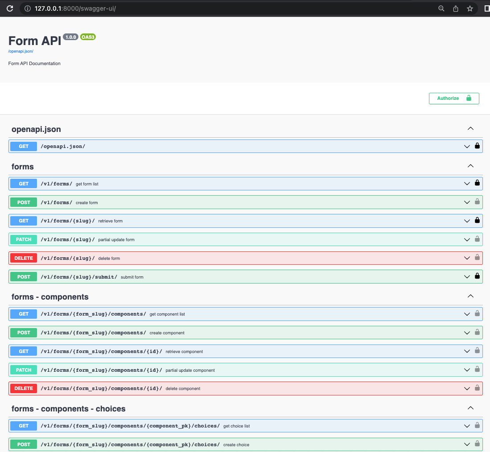

# Form application with Django and DRF
This is a simple form application built using Django and Django Rest Framework(DRF).

## Getting Started

### Install
1. Clone the repository:
```
$ git clone https://github.com/taptorestart/forms.git
```

2. Install dependencies:
```
$ cd backend
$ python -m venv venv
$ source ./venv/bin/activate
$ pip install -r requirements.txt
```

### Run
1. Run the migrations:
```
$ python manage.py migrate
```

2. Create superuser:
```
$ python manage.py createsuperuser
```

3. Set environment variables:

Create .env file on the project root directory. And set your values. 
```
DJANGO_SETTINGS_MODULE=config.settings.api or config.settings.admin
DB_NAME=YOUR_DB_NAME
DB_USER=YOUR_DB_USER
DB_PASSWORD=YOUR_DB_PASSWORD
DB_HOST=YOUR_DB_HOST
DB_PORT=YOUR_DB_PORT
```

4. Run

```
$ python manage.py runserver
```

/swagger-ui/


